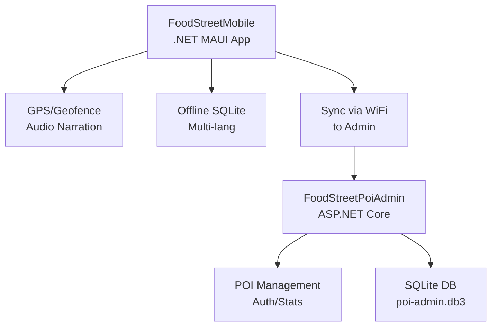

# FoodStreet
## Overview

FoodStreet is a multilingual food street tour system designed to help tourists explore culinary areas through a mobile application with GPS, geofencing, and audio narration, along with a web-based management system for shop owners and administrators.

The project is built using C# and the .NET ecosystem, including .NET MAUI for mobile and ASP.NET Core for Web & API, following a clean, layered architecture to ensure scalability, maintainability, and offline-first capability.

This project is suitable for learning and practicing .NET MAUI, ASP.NET Core, RESTful APIs, SQLite, GPS tracking, and geofencing in a real-world smart tourism context.

## Features

Mobile Application (Tourist)
- Display food street POIs (Points of Interest) on a map
- Show real-time user location
- GPS tracking with battery optimization
Geofencing:
- Trigger audio narration when entering or approaching a POI
- Priority-based POI selection
- Audio narration system:
- Audio file playback or TTS fallback
Queue management
- Cooldown & debounce to prevent duplicate playback
- Background location tracking
- Multilingual support
- Offline-first architecture using SQLite
- Automatic data synchronization when WiFi is available

Web Management System (Shop Owner & Admin)
Authentication & role-based access control:
- Admin: full system management
- Shop Owner: manage own POIs and content
Manage POIs:
- Name, description, images
- Audio narration
- Translations
Tour management
View statistics:
- POI views
- Audio play counts
Content synchronization for mobile app

## Data Analytics (Anonymous)
- User movement paths (anonymous)
- Top most-listened POIs
- Average listening time per POI
- Heatmap-ready location logs

## Technologies Used:

Mobile
- .NET MAUI
- C#
- GPS & Background Services
- Text-to-Speech (TTS)
- SQLite (offline storage)
  
Backend & Admin
- ASP.NET Core MVC (net10.0)
- JWT Auth (Microsoft.AspNetCore.Authentication.JwtBearer)
- SQLite (Microsoft.Data.Sqlite)
- Razor Pages / Controllers
  
General
- .NET 8+
- Dependency Injection
- Clean / Layered Architecture

## Project Structure (Typical)

**Actual Structure:**
```
FoodStreet/
├── FoodStreetMobile/     # MAUI mobile app
│   ├── Pages/*.xaml(.cs) # HomePage, AuthPage, ProfilePage
│   ├── Services/         # GPS, Narration, Sync
│   ├── Models/           # PoiEntity, UserProfileEntity
│   ├── ViewModels/
│   ├── Localization/
│   └── bin/              # APK builds
├── FoodStreetPoiAdmin/   # Web admin
│   ├── Controllers/
│   ├── wwwroot/
│   └── poi-admin.db3
├── DoAn.sln
└── README.md
```

## System Architecture

Mobile App: Offline-first, GPS tracking, geofencing, audio narration
Admin Panel: POI CRUD, user management, stats dashboard
Web Management: Content & system administration
Database:
- SQLite (local & server)
- Sync via WiFi

## Prerequisites:

- .NET SDK 8+ (`dotnet --version`)
- Visual Studio 2022+
- Android SDK (for mobile testing)
- SQLite
- Internet connection (for sync & map services)

## Getting Started

### Quick Start (Local)

**No git clone needed (local project).**

1. Restore solution:
```
dotnet restore DoAn.sln
```

2. Run Web Admin

```
dotnet run --project FoodStreetPoiAdmin/FoodStreetPoiAdmin.csproj --urls "http://localhost:5000"
```
Visit: http://localhost:5000

**Mobile App:**
- Open **DoAn.sln** in Visual Studio 2022+
- Right-click **FoodStreetMobile** > Set as Startup
- Select Android device/emulator
- Press F5

## Learning Objectives

- Build a real mobile application using .NET MAUI
- Apply GPS & Geofencing in real-world scenarios
- Design offline-first mobile architecture
- Implement RESTful APIs with ASP.NET Core
- Practice clean architecture & separation of concerns
- Develop a full-stack .NET system

## Contributing

Contributions are welcome.
- Fork the repository
- Create a new branch
- Commit your changes
- Open a Pull Request

## License

No License.
